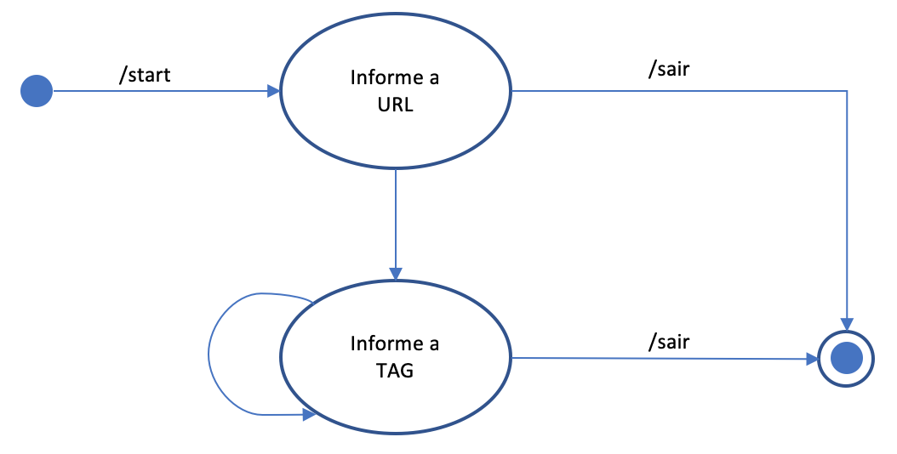

<b><b1>How to create a Bot in Telegram</b1></b> 
1. In Telegram open a chat with @BotFather 
2. Send a command "/newbot" 
3. Write name's bot 
4. Write nickname's bot - the nickname's bot must have the word 'bot'. E.g: My_first_Bot 
5. Save the API/Token generated. This Code will used for configure you bot  

<b><b1>Things to do before start your Bot</b1></b> 
1. Clone this repository <code>git clone https://github.com/wcristoni/botjs.git</code> 
2. Find the file token.js and replace the text 'PUT YOUR KEY CODE HERE!' to your API/Token generated before. 
3. Return for the root folder (botjs/) 
4. Install the dependencies for your Node JS: <code>npm install</code>  
5. Start your Node JS local: <code>npm start</code>  
6. Add your bot in you chat in Telegram
7. Give following command in your Telegram chat: <code>/start</code>

<b><b1>What does this bot do?</b1></b> 
The first version attend only two commands:  
'/url' - for save a new url 
'/stop'- for exit 

<b><b1>How this bot works?</b1></b> 
This bot are using State Machine as shown in the image below: 
