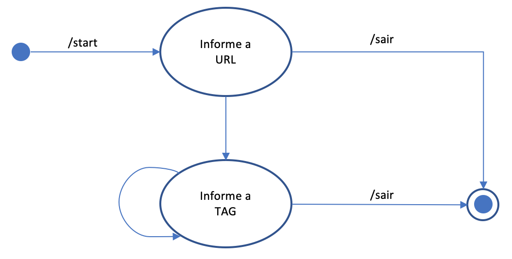

# Telegram Xerife bot

Example of Bot using Javascript Machine State

# How to run it

First, get a bot token from the [@BotFather](http://telegram.me/botfather). Once you got that, clone the repo, create a `.env`
file with the same format as `.env.example` and put the token it gives you there. 

Then:

```
npm install
node index.js
```

And your bot should start answering ```/url``` Telegram, like image below:


